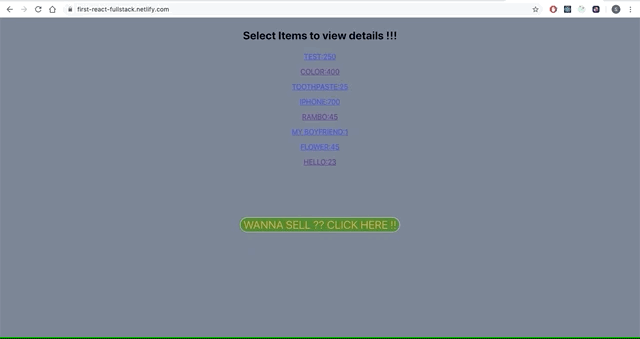

## FullStack-labs-Client
First full-stack App for e-bay clone for sale and buy purpose with collaboration with **MerylGeugies** [MerylGeugies](https://github.com/MerylGeugies/)


## Running the app locally
Clone app from SubashPradhan/fullstack-labs-client (https://github.com/SubashPradhan/fullstack-labs-client)

## Project setup
```
* CD into folder 
* Run npm install & npm run start
```

Runs the app in the development mode.<br>
Open [http://localhost:3000](http://localhost:3000) to view it in the browser.

The page will reload if you make edits.<br>
You will also see any lint errors in the console.

## Technologies

* React, Redux, SuperAgent  <br>

# Acknowledgments

Special thanks to Meryl, as a Collborator. 

* Working and learning together was fun @ Codaisseur
